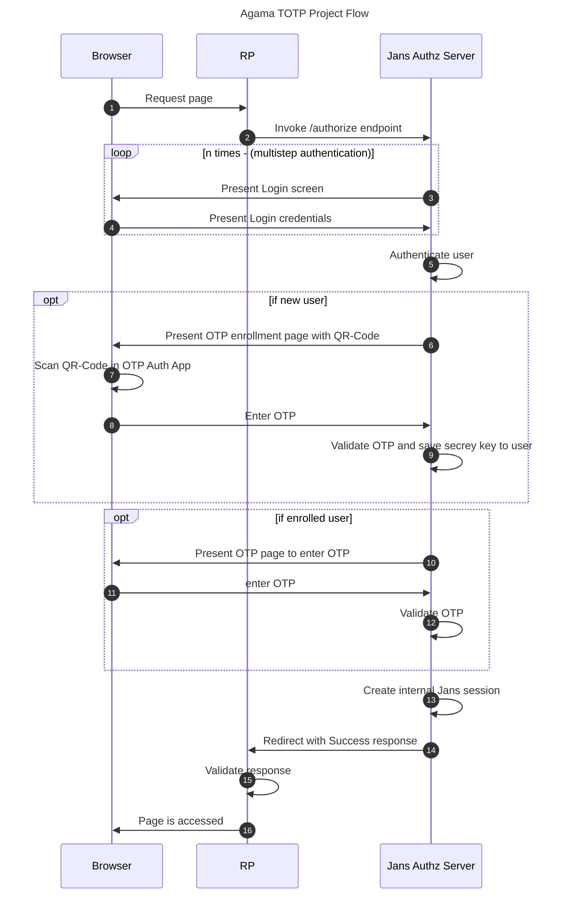

[![Contributors][contributors-shield]](contributors-url)
[![Forks][forks-shield]](forks-url)
[![Stargazers][stars-shield]](stars-url)
[![Issues][issues-shield]](issues-url)
[![Apache License][license-shield]](license-url)

# Gluu Agama TOTP Project

Welcome to the [https://github.com/GluuFederation/agama-OATH-TOTP](https://github.com/GluuFederation/agama-OATH-TOTP) project. This project is governed by Gluu and published under an Apache 2.0 license.

Use this project to add user authentication with TOTP(Time-based One-time Passwords) 2-factor authentication.

## How it works at a glance

When the main flow of this project is launched (namely, `org.gluu.agama.totp.main`) it shows the login page. The user enters a username and password. After the user authn, the OTP enrollmen page opens for new user and if a user is already enrolled then it will directly ask for OTP.



## Flows

The project consists of four flows that provide incremental functionality:

- **org.gluu.agama.totp.main**: This is the main flow which you can directly launch from the browser. It first proceeds for user authn by triggering `org.gluu.agama.totp.pw` flow. Then helps to check user is already enrolled for TOTP 2FA or not. If a new user then trigger `org.gluu.agama.enroll` otherwise `org.gluu.agama.otp` and validate TOTP.

- **org.gluu.agama.totp.pw**: This flow is used for user authn. It first asks the user to enter a username, and password, and validate the user.

- **org.gluu.agama.enroll**: This flow is used to enroll new users into TOTP 2FA. It provides an enrollment page with a QR-Code. Users need to scan the QR-Code in any Authenticator App and enter OTP. At the end, it returns a validation response.

- **org.gluu.agama.otp**: This flow is used to validate OTP. If the user is already enrolled in TOTP 2FA then it provides an OTP page and asks the user to enter an OTP and return a validation response.

## Config

Config parameters for main flow:

```js
{
  "org.gluu.agama.totp.main": {
      "issuer": "your-host-or-title",
      "qrCodeLabel": "Gluu",
      "qrCodeAlg": "sha1",
      "qrCodeKeyLength": 20
  }
}
```

| Name              | Description                                                           | Notes                                   |
| ----------------- | --------------------------------------------------------------------- | --------------------------------------- |
| `issuer`          | Issuer of the OTP service                                             | Keep it simple and little e.g. gluu.org |
| `qrCodeLabel`     | This config is used to add your brand name into the center of QR Code | Keep it simple and little               |
| `qrCodeKeyLength` | Key length to generate Secret Key                                     | Default is `20`                         |
| `qrCodeAlg`       | Algorithm used to validate TOTP                                       | Default is `sha1`                       |

# Core Developers

<table>
 <tr>
  <td align="center" style="word-wrap: break-word; width: 150.0; height: 150.0">
    <a href=https://github.com/kdhttps>
        
        <br />
        <sub style="font-size:14px"><b>Kiran Mali</b></sub>
    </a>
  </td>
 </tr>
</table>

# License

This project is licensed under the [Apache 2.0](https://github.com/GluuFederation/agama-OATH-TOTP/blob/main/LICENSE)

<!-- This are stats url reference for this repository -->

[contributors-shield]: https://img.shields.io/github/contributors/GluuFederation/agama-OATH-TOTP.svg?style=for-the-badge
[contributors-url]: https://github.com/GluuFederation/agama-OATH-TOTP/graphs/contributors
[forks-shield]: https://img.shields.io/github/forks/GluuFederation/agama-OATH-TOTP.svg?style=for-the-badge
[forks-url]: https://github.com/GluuFederation/agama-OATH-TOTP/network/members
[stars-shield]: https://img.shields.io/github/stars/GluuFederation/agama-OATH-TOTP?style=for-the-badge
[stars-url]: https://github.com/GluuFederation/agama-OATH-TOTP/stargazers
[issues-shield]: https://img.shields.io/github/issues/GluuFederation/agama-OATH-TOTP.svg?style=for-the-badge
[issues-url]: https://github.com/GluuFederation/agama-OATH-TOTP/issues
[license-shield]: https://img.shields.io/github/license/GluuFederation/agama-OATH-TOTP.svg?style=for-the-badge
[license-url]: https://github.com/GluuFederation/agama-OATH-TOTP/blob/main/LICENSE
