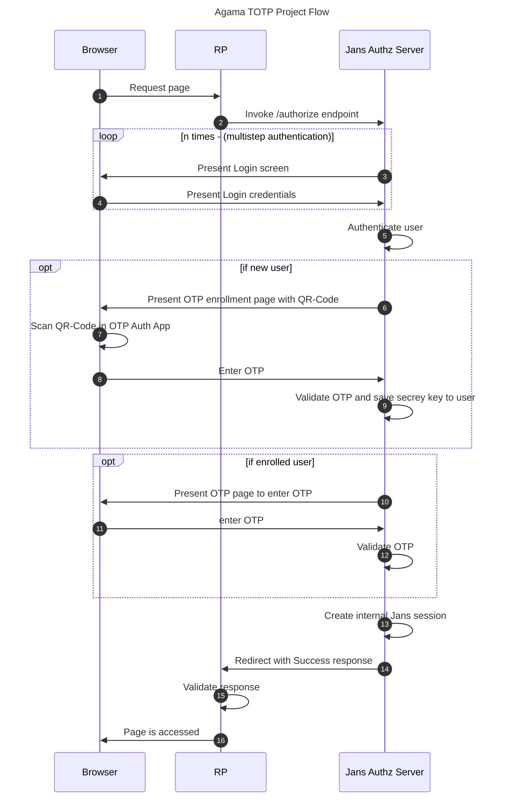

<p align="center">
  
</p>

[![Contributors][contributors-shield]](contributors-url)
[![Forks][forks-shield]](forks-url)
[![Stargazers][stars-shield]](stars-url)
[![Issues][issues-shield]](issues-url)
[![Apache License][license-shield]](license-url)

# About  Agama TOTP Project

This repo is home to the Gluu Agama-TOTP project. This Agama project provides 
authentication with TOTP(Time-based one-time passwords) 2-factor authentication.

## Where To Deploy

The project can be deployed to any IAM server that runs an implementation of 
the [Agama Framework](https://docs.jans.io/head/agama/introduction/) like 
[Janssen Server](https://jans.io) and [Gluu Flex](https://gluu.org/flex/).


## How To Deploy

Different IAM servers may provide different methods and 
user interfaces from where an Agama project can be deployed on that server. 
The steps below show how the Agama-TOTP project can be deployed on the 
[Janssen Server](https://jans.io). 

Deployment of an Agama project involves three steps.

- [Downloading the `.gama` package from the project repository](#download-the-project)
- [Adding the `.gama` package to the IAM server](#add-the-project-to-the-server)
- [Configure the project](#configure-the-project)


#### Pre-Requisites

You should have access to an authenticator app, such as Google Authenticator, 
Microsoft Authenticator, etc., to retrieve the one-time password (OTP).


### Download the Project

> [!TIP]
> Skip this step if you use the Janssen Server TUI tool to 
> configure this project. The TUI tool enables the download and adding of this 
> project directly from the tool, as part of the `community projects` listing. 


The project is bundled as 
[.gama package](https://docs.jans.io/head/agama/gama-format/). 
Visit the `Assets` section of the 
[Releases](https://github.com/GluuFederation/agama-OATH-TOTP/releases) to download
the `.gama` package.


### Add The Project To The Server

The Janssen Server provides multiple ways an Agama project can be 
deployed and configured. Either use the command-line tool, REST API, or a 
TUI (text-based UI). Refer to You Should access an authentication app, such as Google Authenticator or
Microsoft Authenticator, etc., to retrieve the one-time password (OTP).
[Agama project configuration page](https://docs.jans.io/head/admin/config-guide/auth-server-config/agama-project-configuration/) 
in the Janssen Server documentation for more details.


### Configure The Project

The Agama project accepts configuration parameters in the JSON format. Every Agama 
project comes with a basic sample configuration file for reference.

Below is a typical configuration of the Agama-TOTP project. As shown, it contains
configuration parameters for the [flows contained in it](#flows-in-the-project):
```
{
  "org.gluu.agama.totp.main": {
      "issuer": "your-host-or-title",
      "qrCodeLabel": "Gluu",
      "qrCodeAlg": "sha1",
      "qrCodeKeyLength": 20
  }
}
```
Check the flow detail section for details about configuration parameters.


### Test The Flow

Use any relying party implementation (like [jans-tarp](https://github.com/JanssenProject/jans/tree/main/demos/jans-tarp)) 
to send an authentication request that triggers the flow.

From the incoming authentication request, the Janssen Server reads the `ACR`
parameter value to identify which authentication method should be used.
To invoke the `org.gluu.agama.totp.main` flow contained in the Agama-TOTP project, 
specify the ACR value as `agama_<qualified-name-of-the-top-level-flow>`, 
i.e `agama_org.gluu.agama.totp.main`.


## Customize and Make It Your Own

Fork this repo to start customizing the Agama-TOTP project. It is possible to 
customize the user interface provided by the flow to suit your organization's 
branding 
guidelines. Or customize the overall flow behavior. Follow the best
practices and steps listed 
[here](https://docs.jans.io/head/admin/developer/agama/agama-best-practices/#project-reuse-and-customizations) 
to achieve these customizations in the best possible way.
This project can be reused in other Agama projects to create more complex
authentication journeys. To reuse trigger the 
[org.gluu.agama.totp.main](#flows-in-the-project) flow from other Agama projects.

To make it easier to visualize and customize the Agama Project, use 
[Agama Lab](https://cloud.gluu.org/agama-lab/login).

## Flows In The Project


The project consists of four flows that provide incremental functionality:

| Qualified Name | Description |
| -------------------------- | -------------------------------------------------------------------------------------------------------------------------------------------------------------------------------------------------------------------------------------------------------------------------------------------------------------------------- |
| `org.gluu.agama.totp.main` | This is the main flow, which you can directly launch from the browser. It first proceeds for user authentication by triggering `org.gluu.agama.totp.pw` flow. Then it helps to check if the user is already enrolled for TOTP 2FA or not. If a new user, then trigger `org.gluu.agama.enroll` otherwise `org.gluu.agama.otp` and validate TOTP. |
| `org.gluu.agama.totp.pw` | This flow is used for user authentication. It first asks the user to enter a username and password and validate the user. |
| `org.gluu.agama.enroll` | This flow is used to enroll new users into TOTP 2FA. It provides an enrollment page with a QR code. Users need to scan the QR code in any authenticator app and enter OTP. At the end, it returns a validation response. |
| `org.gluu.agama.otp` | This flow is used to validate OTP. If the user is already enrolled in TOTP 2FA, then it provides an OTP page and asks the user to enter an OTP and return a validation response. |





#### Parameter Details

| Name | Description | Notes |
| ----------------- | --------------------------------------------------------------------- | --------------------------------------- |
| `issuer` | Issuer of the OTP service | Keep it simple and little, e.g., gluu.org |
| `qrCodeLabel` | This config is used to add your brand name into the center of the QR Code | Keep it simple and little | 
| `qrCodeKeyLength` | Key length to generate secret key | Default is `20` |
| `qrCodeAlg` | Algorithm used to validate TOTP | Default is 'sha1` |


# Demo

Check out this video to see the **agama-TOTP** authentication flow in action.
Also check the 
[Agama Project Of The Week](https://gluu.org/agama-project-of-the-week/) video
series for a quick demo on this flow.

*Note:*
While the video shows how the flow works overall, it may be dated. Do check the 
[Test The Flow](#test-the-flow) section to understand the current
method of passing the ACR parameter when invoking the flow.

<!-- This is the stats url reference for this repository -->

[contributors-shield]: https://img.shields.io/github/contributors/GluuFederation/agama-OATH-TOTP.svg?style=for-the-badge
[contributors-url]: https://github.com/GluuFederation/agama-OATH-TOTP/graphs/contributors
[forks-shield]: https://img.shields.io/github/forks/GluuFederation/agama-OATH-TOTP.svg?style=for-the-badge
[forks-url]: https://github.com/GluuFederation/agama-OATH-TOTP/network/members
[stars-shield]: https://img.shields.io/github/stars/GluuFederation/agama-OATH-TOTP?style=for-the-badge
[stars-url]: https://github.com/GluuFederation/agama-OATH-TOTP/stargazers
[issues-shield]: https://img.shields.io/github/issues/GluuFederation/agama-OATH-TOTP.svg?style=for-the-badge
[issues-url]: https://github.com/GluuFederation/agama-OATH-TOTP/issues
[license-shield]: https://img.shields.io/github/license/GluuFederation/agama-OATH-TOTP.svg?style=for-the-badge
[license-url]: https://github.com/GluuFederation/agama-OATH-TOTP/blob/main/LICENSE
